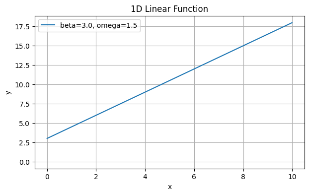
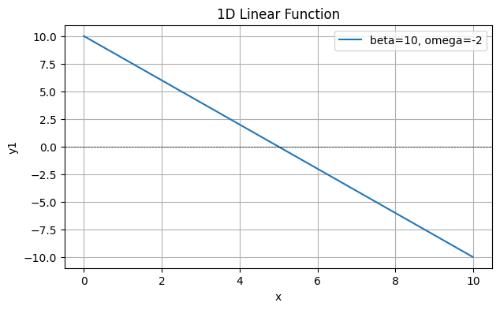
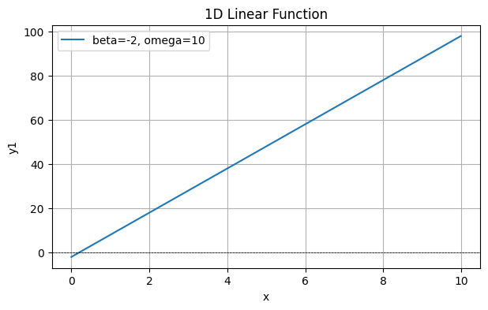
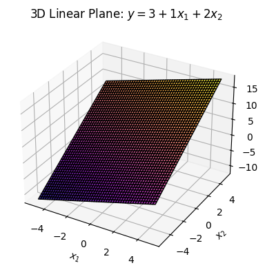
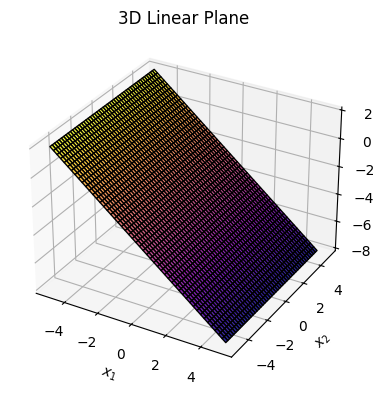
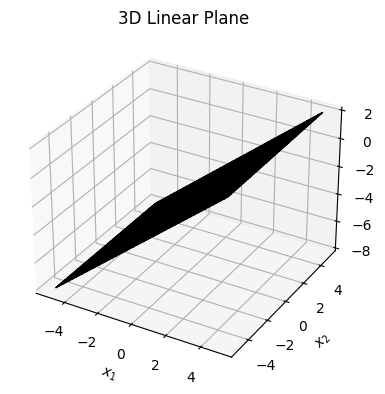
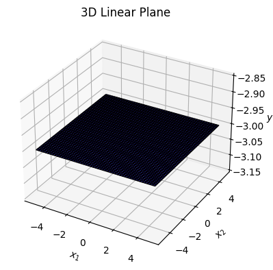
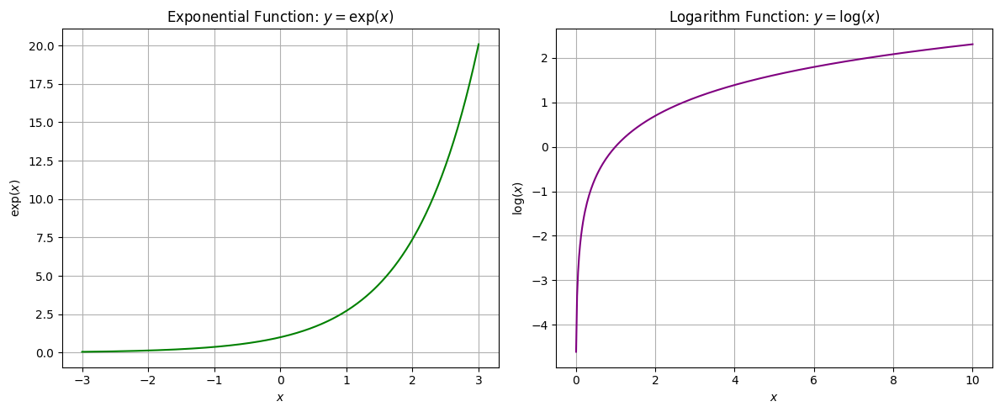
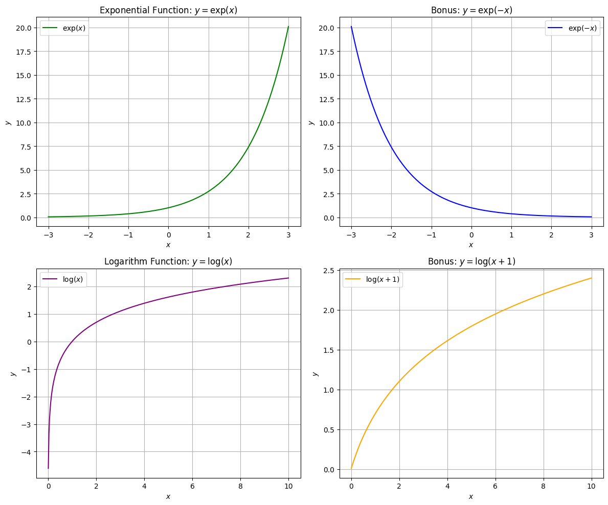

## 🧠 Background Mathematics Refresher

## 1. Core Mathematics Review


```python
from IPython.display import VimeoVideo

VimeoVideo("1105140461", h="3298dbabb7", width=700, height=450)
```


<iframe
    width="700"
    height="450"
    src="https://player.vimeo.com/video/1105140461?h=3298dbabb7"
    frameborder="0"
    allowfullscreen

></iframe>


---
<b> 📚 1.1 What is a Linear Function?</b>

A linear function is the simplest type of mathematical relationship between input and output. It describes a **straight line** (in 1D) or a **flat plane** (in higher dimensions).

In one dimension (1D), the equation of a linear function is:

$$
y = \beta + \omega x
$$

- $\beta$ is called the **bias** or **intercept** — it moves the line up or down.  
- $\omega$ is called the **slope** or **weight** — it tilts the line.

In two dimensions (2D), the linear function generalizes to:

$$
y = \beta + \omega_1 x_1 + \omega_2 x_2
$$

- $x_1$ and $x_2$ are two input features.  
- $\omega_1$ and $\omega_2$ control how each input affects the output.


🔁 Any function that is **not in this form** (e.g., involves $x^2$, $\sin(x)$, etc.) is considered **non-linear**.

---

<b> 🖥️ 1.2 Explore 1D Linear Functions (with Code and Practice) </b>

Create and plot a 1D linear function.


```python
# Import libraries
import numpy as np
import matplotlib.pyplot as plt

# Define a 1D linear function
def linear_function_1D(x, beta, omega):
    return beta + omega * x

# Create an array of x values
x = np.arange(0, 10, 0.01)

# Set parameters
beta = 3.0
omega = 1.5

# Compute y values
y = linear_function_1D(x, beta, omega)

# Plot
plt.figure(figsize=(7, 4))
plt.plot(x, y, label=f"beta={beta}, omega={omega}")
# y label
plt.axhline(0, color='black', lw=0.5, ls='--')
plt.xlabel('x')
plt.ylabel('y')
plt.title('1D Linear Function')
plt.legend()
plt.grid(True)
plt.show()

```


    

    


---
<b> Practice Cell — Your Turn! </b>

🎯 **Code Task 1.0.2.1 – Plot a line with** $\beta=10$ **and** $\omega = -2$

Plot a 1D linear function using the following parameters:

- Set $\beta = 10$ and $\omega = -2$

Assign the resulting y-values to a variable named `y1`.


```python
import numpy as np 
import matplotlib.pyplot as plt

def linear_Function_1D (x, beta, omega):
    return beta + omega * x

x = np.arange(0, 10, 0.01)

beta = 10
omega = -2

# Compute y1 values
y1 = linear_Function_1D (x, beta, omega) 

# Plot
plt.figure(figsize=(7, 4))
plt.plot(x, y1, label=f"beta={beta}, omega={omega}")
# y label
plt.axhline(0, color='black', lw=0.5, ls='--')
plt.xlabel('x')
plt.ylabel('y1')
plt.title('1D Linear Function')
plt.legend()
plt.grid(True)
plt.show()
```


    

    


<b> ❓ Questions to think about:</b>

- How does changing $\beta$ affect the graph?
- How does changing $\omega$ affect the slope?

It's time to answer **Multiple Choice Questions 1.0.2.1 and 1.0.2.2**!

✅ **Hint:** Update `beta` and `omega` in the code cell above and re-run it to see the changes.


```python
import numpy as np 
import matplotlib.pyplot as plt

def linear_Function_1D (x, beta, omega):
    return beta + omega * x

x = np.arange(0, 10, 0.01)

beta = -2
omega = 10

# Compute y1 values
y1 = linear_Function_1D (x, beta, omega) 

# Plot
plt.figure(figsize=(7, 4))
plt.plot(x, y1, label=f"beta={beta}, omega={omega}")
# y label
plt.axhline(0, color='black', lw=0.5, ls='--')
plt.xlabel('x')
plt.ylabel('y1')
plt.title('1D Linear Function')
plt.legend()
plt.grid(True)
plt.show()
```


    

    


Changing Beta affects the graph to shift the line vertically

---
<b> 📚 1.3 What About 2D Linear Functions?<b>

<b>📐 Linear Function in Two Dimensions</b>

In two dimensions, we have two input variables: $x_1$ and $x_2$.  
The linear function becomes:

$$
y = \beta + \omega_1 x_1 + \omega_2 x_2
$$

- $\omega_1$ controls the effect of $x_1$  
- $\omega_2$ controls the effect of $x_2$  
- $\beta$ still shifts the output up or down

---

📈 Instead of a **straight line** (as in 1D), in 2D this equation represents a **plane**!


<b> Code Cell </b>

Create and plot a 2D linear function.


```python
# 🔍 Sample 3D Linear Plane: y = 3 + 1*x1 + 2*x2

import numpy as np
import matplotlib.pyplot as plt
from mpl_toolkits.mplot3d import Axes3D

# Set sample values
beta = 3.0
omega1 = 1.0
omega2 = 2.0

# Create a grid of x1 and x2 values
x1_vals = np.linspace(-5, 5, 50)
x2_vals = np.linspace(-5, 5, 50)
X1, X2 = np.meshgrid(x1_vals, x2_vals)

# Compute y values based on the linear plane formula
Y = beta + omega1 * X1 + omega2 * X2

# Plotting the 3D surface
fig = plt.figure(figsize=(7, 4))
ax = fig.add_subplot(111, projection='3d')
ax.plot_surface(X1, X2, Y, cmap='plasma', edgecolor='k', alpha=0.85)

# Labels and title
ax.set_xlabel('$x_1$')
ax.set_ylabel('$x_2$')
ax.set_zlabel('$y$')
ax.set_title('3D Linear Plane: $y = 3 + 1x_1 + 2x_2$')

plt.tight_layout()
plt.show()

```


    

    


<b> 🧪 Practice Cell — Your Turn!</b>

🎯 **Code Task 1.0.3.1**

Create a 3D linear surface using the following parameters:

- Set $\omega_1 = 1$. 
- Set $\omega_2 = 0$. 
- Set $\beta = -3$ 

Assign the resulting surface (Y values) to a variable named `Y1`.


```python
import numpy as np
import matplotlib.pyplot as plt
from mpl_toolkits.mplot3d import Axes3D

beta = -3
omega1 = -1
omega2 = 0

x1_vals = np.linspace(-5, 5, 50)
x2_vals = np.linspace(-5, 5, 50)
X1, X2 = np.meshgrid(x1_vals, x2_vals)


# Compute Y1 values based on the linear plane formula
Y1 = beta + omega1 * X1 + omega2 * X2


# Plotting the 3D surface
fig = plt.figure(figsize=(7, 4))
ax = fig.add_subplot(111, projection='3d')
ax.plot_surface(X1, X2, Y1, cmap='plasma', edgecolor='k', alpha=0.85)

# Labels and title
ax.set_xlabel('$x_1$')
ax.set_ylabel('$x_2$')
ax.set_zlabel('$y$')
ax.set_title('3D Linear Plane')

plt.tight_layout()
plt.show()
```


    

    


<b> 📝 Mini Reflection Question </b>

**Q:** In your own words, what happens if one of the $\omega$ weights is zero?

It's time to answer **Multiple Choice Questions 1.0.3.1**!


```python
import numpy as np
import matplotlib.pyplot as plt
from mpl_toolkits.mplot3d import Axes3D

beta = -3
omega1 = 1
omega2 = 0

x1_vals = np.linspace(-5, 5, 50)
x2_vals = np.linspace(-5, 5, 50)
X1, X2 = np.meshgrid(x1_vals, x2_vals)


# Compute Y1 values based on the linear plane formula
Y1 = beta + omega1 * X1 + omega2 * X2


# Plotting the 3D surface
fig = plt.figure(figsize=(7, 4))
ax = fig.add_subplot(111, projection='3d')
ax.plot_surface(X1, X2, Y1, cmap='plasma', edgecolor='k', alpha=0.85)

# Labels and title
ax.set_xlabel('$x_1$')
ax.set_ylabel('$x_2$')
ax.set_zlabel('$y$')
ax.set_title('3D Linear Plane')

plt.tight_layout()
plt.show()
```


    

    


```python
import numpy as np
import matplotlib.pyplot as plt
from mpl_toolkits.mplot3d import Axes3D

beta = -3
omega1 = 0
omega2 = 0

x1_vals = np.linspace(-5, 5, 50)
x2_vals = np.linspace(-5, 5, 50)
X1, X2 = np.meshgrid(x1_vals, x2_vals)


# Compute Y1 values based on the linear plane formula
Y1 = beta + omega1 * X1 + omega2 * X2


# Plotting the 3D surface
fig = plt.figure(figsize=(7, 4))
ax = fig.add_subplot(111, projection='3d')
ax.plot_surface(X1, X2, Y1, cmap='plasma', edgecolor='k', alpha=0.85)

# Labels and title
ax.set_xlabel('$x_1$')
ax.set_ylabel('$x_2$')
ax.set_zlabel('$y$')
ax.set_title('3D Linear Plane')

plt.tight_layout()
plt.show()
```


    

    


---
<b> 📚 1.4 Linear Functions in Vector and Matrix Form </b>


```python
from IPython.display import VimeoVideo

VimeoVideo("1105140491", h="3298dbabb7", width=700, height=450)
```


<iframe
    width="700"
    height="450"
    src="https://player.vimeo.com/video/1105140491?h=3298dbabb7"
    frameborder="0"
    allowfullscreen

></iframe>


When we have multiple inputs and outputs, writing each linear function separately gets messy.  
Instead, we can express everything **compactly using vectors and matrices**!


✏️ **Example:**

Suppose we have **two outputs** ($y_1$, $y_2$) and **three inputs** ($x_1$, $x_2$, $x_3$):

$$
\begin{aligned}
y_1 &= \beta_1 + \omega_{11}x_1 + \omega_{12}x_2 + \omega_{13}x_3 \\
y_2 &= \beta_2 + \omega_{21}x_1 + \omega_{22}x_2 + \omega_{23}x_3
\end{aligned}
$$

We can write this in **matrix form** as:

$$
\mathbf{y} = \boldsymbol{\beta} + \boldsymbol{\Omega} \mathbf{x}
$$


Where:

- **Input vector** $\mathbf{x}$:
  $$
  \mathbf{x} = \begin{bmatrix} x_1 \\ x_2 \\ x_3 \end{bmatrix}
  $$

- **Weight matrix** $\boldsymbol{\Omega}$:
  $$
  \boldsymbol{\Omega} =
  \begin{bmatrix}
  \omega_{11} & \omega_{12} & \omega_{13} \\
  \omega_{21} & \omega_{22} & \omega_{23}
  \end{bmatrix}
  $$

- **Bias vector** $\boldsymbol{\beta}$:
  $$
  \boldsymbol{\beta} = \begin{bmatrix} \beta_1 \\ \beta_2 \end{bmatrix}
  $$

- **Output vector** $\boldsymbol{y}$:
  $$
  \mathbf{y} = \begin{bmatrix} y_1 \\ y_2 \end{bmatrix}
  $$

This form is compact, scalable, and ideal for implementation in machine learning libraries like NumPy, PyTorch, or TensorFlow.


<b>Now, lets implement linear functions using both methods!


```python
# Individual equation approach
def linear_function_3D(x1, x2, x3, beta, omega1, omega2, omega3):
    return beta + omega1 * x1 + omega2 * x2 + omega3 * x3

# Sample input
x1 = 4
x2 = -1
x3 = 2

# Parameters
beta1 = 0.5
beta2 = 0.2
omega11, omega12, omega13 = -1.0, 0.4, -0.3
omega21, omega22, omega23 = 0.1, 0.1, 1.2

# Compute outputs individually
y1 = linear_function_3D(x1, x2, x3, beta1, omega11, omega12, omega13)
y2 = linear_function_3D(x1, x2, x3, beta2, omega21, omega22, omega23)

# Matrix-vector form
import numpy as np

# Inputs as vector
x_vec = np.array([[x1], [x2], [x3]])

# Weight matrix
omega_mat = np.array([
    [omega11, omega12, omega13],
    [omega21, omega22, omega23]
])

# Bias vector
beta_vec = np.array([[beta1], [beta2]])

# Compute matrix-vector output
y_vec = beta_vec + np.matmul(omega_mat, x_vec)

print("Individual Equations:")
print(f"y1 = {beta1} + ({omega11} * {x1}) + ({omega12} * {x2}) + ({omega13} * {x3}) = {y1:.3f}")
print(f"y2 = {beta2} + ({omega21} * {x1}) + ({omega22} * {x2}) + ({omega23} * {x3}) = {y2:.3f}")

print("\nMatrix-Vector Form:")

print("x vector:")
print(x_vec)

print("\nOmega (weight) matrix:")
print(omega_mat)

print("\nBeta (bias) vector:")
print(beta_vec)

print("\nComputed output vector (y = β + Ωx):")
print(y_vec)
```

    Individual Equations:
    y1 = 0.5 + (-1.0 * 4) + (0.4 * -1) + (-0.3 * 2) = -4.500
    y2 = 0.2 + (0.1 * 4) + (0.1 * -1) + (1.2 * 2) = 2.900
    
    Matrix-Vector Form:
    x vector:
    [[ 4]
     [-1]
     [ 2]]
    
    Omega (weight) matrix:
    [[-1.   0.4 -0.3]
     [ 0.1  0.1  1.2]]
    
    Beta (bias) vector:
    [[0.5]
     [0.2]]
    
    Computed output vector (y = β + Ωx):
    [[-4.5]
     [ 2.9]]


<b> 🧪 Practice Cell — Your Turn!</b>

🎯 **Code Task 1.0.4.1**

Modify the code to work with:
- **Three outputs**: $y_1$, $y_2$, $y_3$
- **Two inputs**: $x_1$, $x_2$

You are given two inputs:

- $x_1 = 2$  
- $x_2 = -3$

Use the following fixed weights and biases:

- **Weight matrix**  
  $$
  \Omega = \begin{bmatrix}
  1 & -2 \\\\
  0.5 & 0.1 \\\\
  -1 & 3
  \end{bmatrix}
  $$

- **Bias vector**  
  $$
  \beta = \begin{bmatrix}
  1 \\\\
  0 \\\\
  -2
  \end{bmatrix}
  $$

Compute the linear output using:

$$
\mathbf{y} = \beta + \Omega \cdot \mathbf{x}
$$

You must store the final result in a variable named **`y_fixed`**.

---

✅ **Hint:**  
Think of the weight matrix $\boldsymbol{\Omega}$ as a $3 \times 2$ matrix, the input vector $\mathbf{x}$ as a $2 \times 1$ column vector, and the bias vector $\boldsymbol{\beta}$ as $3 \times 1$.

Then compute:

$$
\mathbf{y} = \boldsymbol{\beta} + \boldsymbol{\Omega} \mathbf{x}
$$

This will give you a $3 \times 1$ output vector.


```python
import numpy as np

# Inputs (2 inputs)
x1 = 4
x2 = -1

# Input vector (2x1)
x_vec = np.array([[x1],
                  [x2]])

# Correct weight matrix (3x2)
omega_mat = np.array([
    [2, -1],
    [0.1, 0.3],
    [-3, 1]
])

# Correct bias vector (3x1)
beta_vec = np.array([
    [0],
    [0.6],
    [0]
])

# Compute output
y_fixed = beta_vec + np.matmul(omega_mat, x_vec)

# Display result
print("y_fixed =")
print(y_fixed)
```

    y_fixed =
    [[  9. ]
     [  0.7]
     [-13. ]]


<b> 📝 Mini Reflection Question </b>

**Q:** Why is it useful to use matrix form instead of writing out individual equations?


<b> 📖 Introduction to Special Functions

#### 🔹 Exponential Function $\exp[x]$

- Maps $x \in (-\infty, +\infty)$ to $\exp[x] \in (0, +\infty)$  
- Grows **very fast** for positive $x$, shrinks **toward zero** for negative $x$  
- Used in many models like **softmax**, **log-likelihoods**, etc.  
- **Shape:** Convex

#### 🔹 Logarithm Function $\log[x]$

- Defined only for $x > 0$  
- Maps $x \in (0, +\infty)$ to $\log[x] \in (-\infty, +\infty)$  
- **Slowly increasing** function  
- **Shape:** Concave

✅ We can visualize these to build intuition.


<b> 🖥️ Code Cell Plot Exponential and Logarithm


```python
import numpy as np
import matplotlib.pyplot as plt

# Create x values
x_exp = np.linspace(-3, 3, 400)
x_log = np.linspace(0.01, 10, 400)  # avoid log(0)

# Compute y values
y_exp = np.exp(x_exp)
y_log = np.log(x_log)

# Create subplots
fig, axs = plt.subplots(1, 2, figsize=(12, 5))

# Plot exponential
axs[0].plot(x_exp, y_exp, color='green')
axs[0].set_title('Exponential Function: $y = \exp(x)$')
axs[0].set_xlabel('$x$')
axs[0].set_ylabel('$\exp(x)$')
axs[0].grid(True)

# Plot logarithm
axs[1].plot(x_log, y_log, color='purple')
axs[1].set_title('Logarithm Function: $y = \log(x)$')
axs[1].set_xlabel('$x$')
axs[1].set_ylabel('$\log(x)$')
axs[1].grid(True)

plt.tight_layout()
plt.show()

```


    

    


<b> 🏋️ Practice Cell : Quick Quiz

📝 Time to Answer **Multiple Choice Questions 1.0.4.1 and 1.0.4.2**


Bonus! Practice for extra exploration:

* What happens if we plot $exp(-x)$?
* What happens if we plot $log(x+1)$?

💡 Try modifying the code to include these and observe how the shapes change!


```python
import numpy as np
import matplotlib.pyplot as plt

# Create x values
x_exp = np.linspace(-3, 3, 400)
x_log = np.linspace(0.01, 10, 400)  # avoid log(0)

# Compute y values
y_exp = np.exp(x_exp)
y_exp_neg = np.exp(-x_exp)
y_log = np.log(x_log)
y_log_plus1 = np.log(x_log + 1)

# Create subplots: 2 rows, 2 columns
fig, axs = plt.subplots(2, 2, figsize=(12, 10))

# Plot exponential
axs[0, 0].plot(x_exp, y_exp, color='green', label='$\exp(x)$')
axs[0, 0].set_title('Exponential Function: $y = \\exp(x)$')
axs[0, 0].set_xlabel('$x$')
axs[0, 0].set_ylabel('$y$')
axs[0, 0].grid(True)
axs[0, 0].legend()

# Plot exponential of negative x
axs[0, 1].plot(x_exp, y_exp_neg, color='blue', label='$\exp(-x)$')
axs[0, 1].set_title('Bonus: $y = \\exp(-x)$')
axs[0, 1].set_xlabel('$x$')
axs[0, 1].set_ylabel('$y$')
axs[0, 1].grid(True)
axs[0, 1].legend()

# Plot logarithm
axs[1, 0].plot(x_log, y_log, color='purple', label='$\log(x)$')
axs[1, 0].set_title('Logarithm Function: $y = \\log(x)$')
axs[1, 0].set_xlabel('$x$')
axs[1, 0].set_ylabel('$y$')
axs[1, 0].grid(True)
axs[1, 0].legend()

# Plot log(x + 1)
axs[1, 1].plot(x_log, y_log_plus1, color='orange', label='$\log(x + 1)$')
axs[1, 1].set_title('Bonus: $y = \\log(x + 1)$')
axs[1, 1].set_xlabel('$x$')
axs[1, 1].set_ylabel('$y$')
axs[1, 1].grid(True)
axs[1, 1].legend()

plt.tight_layout()
plt.show()

```


    

    


---
<b> ✅ Concept Check: Multiple Choice</b>

**Q1.** Which of the following is a linear function?

- (A) $y = 2x + 5$  
- (B) $y = \exp(x)$  
- (C) $y = \log(x)$  
- (D) $y = x^2$  

✅ *Correct Answer: (A)*

---

**Q2.** What happens to $\exp(x)$ as $x \to +\infty$?

- (A) It approaches zero  
- (B) It goes to a constant value  
- (C) It grows toward infinity  
- (D) It oscillates  

✅ *Correct Answer: (C)*

---

**Q3.** In matrix form, which equation correctly represents a linear mapping from input $\mathbf{x}$ to output $\mathbf{y}$?

- (A) $\mathbf{y} = W\mathbf{x} + b$  
- (B) $\mathbf{y} = \log(\mathbf{x}) + b$  
- (C) $\mathbf{y} = \exp(\mathbf{x}) + b$  
- (D) $\mathbf{y} = \sin(\mathbf{x}) + b$  

✅ *Correct Answer: (A)*

---

**Q4.** Which function is **concave**?

- (A) $\exp(x)$  
- (B) $\log(x)$  
- (C) $x^2$  
- (D) $x^3$  

✅ *Correct Answer: (B)*

---

### 📖 Final Summary — Why We Learned This Background Math?

#### 🧠 Summary:

- We explored **linear functions** and saw how they are simple weighted sums of inputs.  
- We visualized **2D and 3D linear functions**, building intuition for how deep learning models perform transformations.  
- We introduced special functions like **exponential** and **logarithm**, which appear everywhere in neural networks (e.g., activations, loss functions).  
- We practiced **vector and matrix notation** — the language of deep learning models.

#### 🔗 Connection to Deep Learning:

- **Linear Functions** ➔ form the foundation of every neural network layer.  
- **Vectors / Matrices** ➔ how inputs, weights, and outputs are structured and computed.  
- **Exponentials** ➔ appear in activation functions like **Sigmoid** and **Softmax**.  
- **Logarithms** ➔ used in loss functions like **Cross-Entropy**.
